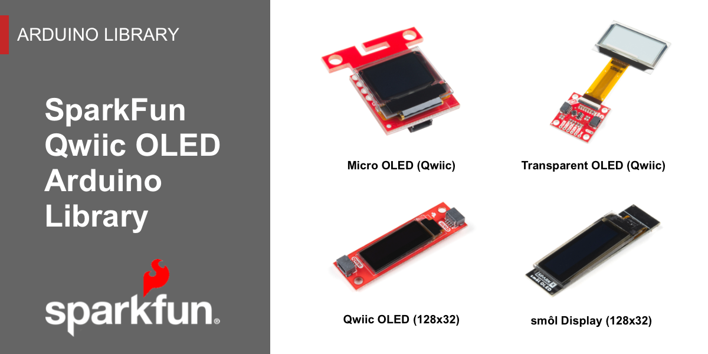

The SparkFun Qwiic OLED Arduino Library is a single graphics module that supports all SparkFun OLED boards based on the SSD1306 from Solomon Systech. Prior to this library, three different libraries were used to support our four different OLED boards.

The SparkFun Qwiic OLED Library delivers a common implementation for all our Qwiic OLED products, delivering a unified, fast, and efficient solution that implements a familiar and easy to understand user experience.

### Key Features

*   Implements common graphics capabilities: pixel, line, rectangle, filled rectangle, circle, filled circle, bitmap, text and raster operators (i.e. XOR).
* Smart data transfer to the device – only sends _dirty_ regions of the graphics buffer to the OLED device, not the entire buffer.
* High performance – 2x faster than our previous OLED library, often much higher.
* Efficient memory usage. No dynamic memory utilized. Static resources are loaded once, and only on explicit declaration.
* Implements a familiar interface, making migration from older libraries straight forward

### Getting Started

The [Software Setup](software.md) outlines library installation and the general use of the Qwiic OLED library.

Detailed examples are included as part of the library installation process and available in the Arduino IDE menu:  **File** > **Examples** >  **SparkFun Qwiic OLED Arduino Library**. A walk-thru of key examples is contained in the [Examples](../sparkfun-qwiic-oled-arduino-library-examples/ex_01_hello/) section of this documentation set.

!!! note
    For v1.0.5 of the SparkFun Qwiic OLED Arduino Library, we named the library as SparkFun Qwiic OLED Graphics Library. After v1.0.6, we updated the name to say SparkFun Qwiic OLED Arduino Library. You may have multiple versions in your Arduino libraries folder if you installed the library more than once. To avoid confusion, issues compiling, and to use the latest version, we recommend removing the "_SparkFun Qwiic OLED Graphics Library_" folder should you decide to use the latest and greatest version. This will probably be located under **..Documents\Arduino\libraries**, that is if you are using Windows.

!!! note
    Note that we have more than one Arduino Library for the micro OLED. If you have the older Arduino Library, make sure to not confuse the two libraries. You will notice that the older library will be called "**SparkFun Micro OLED Breakout**". The example code will include the following line of code: `#include <SFE_MicroOLED.h>`.

A full [API Reference](../api_device) is also provided for the library.

<a href="../api_device" class="md-button md-button--primary">SparkFun Qwiic OLED Arduino Library: API Reference</a>

### Supported Products

The SparkFun Qwiic OLED Arduino Library supports the following SparkFun products.

<!-- ----------WHITE SPACE BETWEEN PRODUCTS---------- -->
-   <a href="https://www.sparkfun.com/products/22495">
      <figure markdown>
        
      </figure>
    </a>

    ---

    <a href="https://www.sparkfun.com/products/22495">
      <b>SparkFun Micro OLED Breakout (Qwiic)</b>
       
      LCD-22495
    </a>
<!-- ----------WHITE SPACE BETWEEN PRODUCTS---------- -->
-   <a href="https://www.sparkfun.com/products/24606">
      <figure markdown>
        
      </figure>
    </a>

    ---

    <a href="https://www.sparkfun.com/products/24606">
      <b>SparkFun Qwiic OLED Display (0.91 in, 128x32)</b>
       
      LCD-24606
    </a>
<!-- ----------WHITE SPACE BETWEEN PRODUCTS---------- -->
-   <a href="https://www.sparkfun.com/products/15173">
      <figure markdown>
        
      </figure>
    </a>

    ---

    <a href="https://www.sparkfun.com/products/15173">
      <b>SparkFun Transparent Graphical OLED Breakout (Qwiic)</b>
       
      LCD-15173
    </a>
<!-- ----------WHITE SPACE BETWEEN PRODUCTS---------- -->
-   <a href="https://www.sparkfun.com/products/23453">
      <figure markdown>
        
      </figure>
    </a>

    ---

    <a href="https://www.sparkfun.com/products/23453">
      <b>SparkFun Qwiic OLED (1.3in., 128x64)</b>
       
      LCD-23453
    </a>
<!-- ----------WHITE SPACE BETWEEN PRODUCTS---------- -->

### Supported Microcontrollers - Arduino Environment

The following architectures are supported in the Arduino Library.

* [Artemis](https://www.sparkfun.com/products/15574)
* [SAMD51](https://www.sparkfun.com/products/14713)
* [ESP32](https://www.sparkfun.com/products/20168)
* [STM32](https://www.sparkfun.com/products/17712)
* [SAMD21](https://www.sparkfun.com/products/14812)
* [nrf5280](https://www.sparkfun.com/products/15025)
* [Teensy](https://www.sparkfun.com/products/16402)
* [ATMega328P](https://www.sparkfun.com/products/18158)

Below are a few of those processors populated on Arduino boards from the [SparkFun catalog](https://www.sparkfun.com/categories/242). You will need to make sure to check the associated hookup guides for additional information about compatible cables, drivers, or board add-ons.

<!-- ----------WHITE SPACE BETWEEN PRODUCTS---------- -->
-   <a href="https://www.sparkfun.com/products/15574">
      <figure markdown>
        
      </figure>
    </a>

    ---

    <a href="https://www.sparkfun.com/products/15574">
      <b>SparkFun Thing Plus - Artemis</b>
       
      WRL-15574
    </a>
<!-- ----------WHITE SPACE BETWEEN PRODUCTS---------- -->
-   <a href="https://www.sparkfun.com/products/14713">
      <figure markdown>
        
      </figure>
    </a>

    ---

    <a href="https://www.sparkfun.com/products/14713">
      <b>SparkFun Thing Plus - SAMD51</b>
       
      DEV-14713
    </a>
<!-- ----------WHITE SPACE BETWEEN PRODUCTS---------- -->
-   <a href="https://www.sparkfun.com/products/20168">
      <figure markdown>
        
      </figure>
    </a>

    ---

    <a href="https://www.sparkfun.com/products/20168">
      <b>SparkFun Thing Plus - ESP32 WROOM (USB-C)</b>
       
      WRL-20168
    </a>
<!-- ----------WHITE SPACE BETWEEN PRODUCTS---------- -->
-   <a href="https://www.sparkfun.com/products/17712">
      <figure markdown>
        
      </figure>
    </a>

    ---

    <a href="https://www.sparkfun.com/products/17712">
      <b>SparkFun Thing Plus - STM32</b>
       
      DEV-17712
    </a>
<!-- ----------WHITE SPACE BETWEEN PRODUCTS---------- -->
-   <a href="https://www.sparkfun.com/products/14812">
      <figure markdown>
        
      </figure>
    </a>

    ---

    <a href="https://www.sparkfun.com/products/14812">
      <b>SparkFun RedBoard Turbo - SAMD21 Development Board</b>
       
      DEV-14812
    </a>
<!-- ----------WHITE SPACE BETWEEN PRODUCTS---------- -->
-   <a href="https://www.sparkfun.com/products/15025">
      <figure markdown>
        
      </figure>
    </a>

    ---

    <a href="https://www.sparkfun.com/products/15025">
      <b>SparkFun Pro nRF52840 Mini - Bluetooth Development Board</b>
       
      DEV-15025
    </a>
<!-- ----------WHITE SPACE BETWEEN PRODUCTS---------- -->
-   <a href="https://www.sparkfun.com/products/16402">
      <figure markdown>
        
      </figure>
    </a>

    ---

    <a href="https://www.sparkfun.com/products/16402">
      <b>SparkFun MicroMod Teensy Processor</b>
       
      DEV-16402
    </a>
<!-- ----------WHITE SPACE BETWEEN PRODUCTS---------- -->
-   <a href="https://www.sparkfun.com/products/18158">
      <figure markdown>
        
      </figure>
    </a>

    ---

    <a href="https://www.sparkfun.com/products/18158">
      <b>SparkFun RedBoard Plus (ATmega328P)</b>
       
      DEV-18158
    </a>
<!-- ----------WHITE SPACE BETWEEN PRODUCTS---------- -->

!!! note
    Unfortunately, the ATmega32U4 is not supported under this library. We recommend either using a different microcontroller or rolling back to the previous library written for the display.

### License

The SparkFun Qwiic OLED Arduino Library is licensed using the Open Source [MIT License](https://github.com/sparkfun/SparkFun_Qwiic_OLED_Arduino_Library/blob/main/LICENSE.md#code):

    --8<-- "LICENSE.md:35:55"
