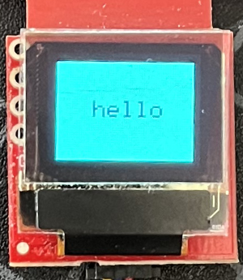

# Example 1 - Hello

A simple example to show the basic setup and use of the SparkFun Qwiic OLED Library.

**Key Demo Features**

* Declaring a Qwiic OLED device object.
* Initializing the Qwiic OLED device
* Drawing a simple graphic - a filled rectangle and a text string
* Using the current font to center text on the screen.
* Displaying the graphics on the screen

## Setup

After installing this library in your local Arduino environment, begin with a standard Arduino sketch, and include the header file for this library.
```C++
// Include the SparkFun qwiic OLED Library
#include <SparkFun_Qwiic_OLED.h>
```
The next step is to declare the object for the SparkFun qwiic OLED device used. Like most Arduino sketches, this is done at a global scope (after the include file declaration), not within the ```setup()``` or ```loop()``` functions. 

The user selects from one of the following classes:

| Class | Qwiic OLED Device |
| :--- | :--- |
| `QwiicMicroOLED` | [SparkFun Qwiic Micro OLED ]( https://www.sparkfun.com/products/14532)| 
| `QwiicNarrowOLED` | [SparkFun Qwiic OLED Display (128x32) ]( https://www.sparkfun.com/products/17153)| 
| `QwiicTransparentOLED` | [SparkFun Transparent Graphical OLED]( https://www.sparkfun.com/products/15173)| 

The Example code supports all of the SparkFun Qwiic OLED boards. To select the board being used, uncomment the `#define` for the demo board. 

For this example, the Qwiic Micro OLED is used.
```C++
#define MICRO
//#define NARROW
//#define TRANSPARENT
``` 
Which results in myOLED being declared as:

```C++
QwiicMicroOLED myOLED;
```
## Initialization

In the ```setup()``` function of this sketch, like all of the SparkFun qwiic libraries, the device is initialized by calling the ```begin()``` method. This method returns a value of ```true``` on success, or ```false``` on failure. 

```C++
void setup()
{

    delay(500);   //Give display time to power on

    // Serial on!
    Serial.begin(115200);

    Serial.println("\n\r-----------------------------------");

    Serial.print("Running Example 01 on: ");
    Serial.println(String(deviceName));

    // Initalize the OLED device and related graphics system
    if(!myOLED.begin()){

        Serial.println(" - Device Begin Failed");
        while(1);
    }

    Serial.println("- Begin Success");

```

## Drawing Graphics

Once the device is enabled, the rest of the setup() function is devoted to drawing a simple graphic on the target device.

### Filled Rectangle

First, draw a filled rectangle on the screen - leave a 4 pixel boarder at the end of the screen. Note that the `getWidth()` and `getHeight()` method are used to get the devices screen size.

```C++
    // fill a rectangle on the screen that has a 4 pixel board
    myOLED.rectangleFill(4, 4, myOLED.getWidth()-4, myOLED.getHeight()-4);
```
### Centered Text

The next part of our graphic is a message centered in the drawn rectangle. To do the centering, the current font is accessed from the device, and the size of a character in the font is used to calculate the text position on the screen.

Once the position is determined, the message is drawn on the display in black (0 for a color value).

```C++
    String hello = "hello"; // our message

    // Lets center our message on the screen. We need to current font. 

    QwiicFont * pFont = myOLED.getFont();

    // starting x position - width minus string length (font width * number of characters) / 2
    int x0 = (myOLED.getWidth() - pFont->width * hello.length())/2;

    int y0 = (myOLED.getHeight() - pFont->height)/2;

    // Draw the text - color of black (0)
    myOLED.text(x0, y0, hello, 0);
```

### Displaying the Graphics

The last step is sending the graphics to the device. This is accomplished by calling the `display()` method.

```C++
    // There's nothing on the screen yet - Now send the graphics to the device
    myOLED.display();
```

And that's in - the graphic is displayed on the OLED device.

